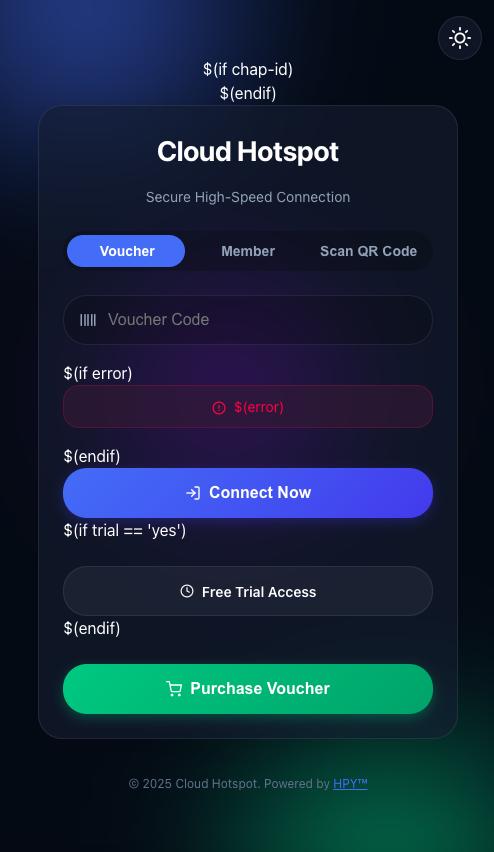

# Nebula Glass Theme (v5.54)
### Premium MikroTik Hotspot Interface with Integrated Payments



**Nebula Glass** is a commercial-grade, high-performance MikroTik Hotspot theme designed for modern ISPs and WISP networks. It combines a stunning glassmorphism aesthetic with powerful features like integrated e-wallet payments, smart browser detection, and carrier identification.

---

## ✨ Key Features

### 🎨 Modern UI/UX
*   **Glassmorphism Design**: Translucent panels with backdrop blur and subtle borders for a premium feel.
*   **Animated Backgrounds**: "Nebula" blobs that float and morph, creating a dynamic atmosphere without heavy video assets.
*   **Responsive Layout**: Flawless experience on mobile, tablet, and desktop devices.
*   **Dark/Light Mode**: Built-in theme switcher with user preference persistence.

### 💳 Integrated Payment System
*   **Direct Voucher Purchase**: Users can buy vouchers directly from the login page.
*   **Multi-Gateway Support**: Ready for **GCash**, **Maya**, **GrabPay**, and **ShopeePay** via Xendit/KLCiS integration.
*   **Plan Carousel**: Interactive swipeable carousel for showcasing internet plans (Express, Daily, Weekly, Monthly).
*   **Number Locking**: Secure purchase flow by locking the user's mobile number before transaction.

### 🧠 Smart Detection
*   **Carrier Detection**: Automatically identifies Philippine mobile carriers (Globe, Smart, DITO, GOMO) based on the prefix and displays a carrier badge.
*   **CNA/Browser Detection**: Detects if the user is in a restricted "Captive Network Assistant" (like the WiFi login popup on iOS/Android) or in-app browsers (Facebook/Messenger) and prompts them to open a full browser for secure payments.

### ⚡ Performance & Tech
*   **Inline SVGs**: No heavy font libraries. All icons are lightweight, crisp SVGs.
*   **Zero Dependencies**: Pure Vanilla JS and CSS. No jQuery or heavy frameworks.
*   **MikroTik Native**: Full support for RouterOS variables, error handling, and status pages.

---

## 🚀 Installation Guide

### Prerequisites
*   MikroTik Router with RouterOS v6 or v7.
*   Hotspot Server configured.
*   FTP or Winbox access to the router.

### Steps
1.  **Download**: Get the latest release of the `myTheme` folder.
2.  **Upload**:
    *   Open Winbox and go to **Files**.
    *   Drag and drop the `myTheme` folder into the root directory (or `flash` folder).
3.  **Activate**:
    *   Go to **IP** -> **Hotspot** -> **Server Profiles**.
    *   Double-click your active profile.
    *   In the **General** tab, change **HTML Directory** to `myTheme`.
    *   Click **Apply** and **OK**.
4.  **Test**: Connect to your WiFi network. The new login page should appear.

---

## ⚙️ Configuration

### 1. Payment Gateway Setup
To enable online payments, you must configure your KLCiS/Xendit API token.

1.  Open `login.html` in a text editor.
2.  Search for the hidden form section (around line 651):
    ```html
    <form id="purchaseForm" action="https://s2.klinternetservices.com/xendit/payment" ...>
        <!-- ATTENTION: CHANGE THE TOKEN VALUE BELOW -->
        <input type="hidden" id="token" name="token" value="YOUR_API_TOKEN_HERE">
    ```
3.  Replace `YOUR_API_TOKEN_HERE` with your actual API token from your payment provider.

### 2. Editing Plans & Prices
You can customize the voucher plans displayed in the carousel directly in `login.html`.

1.  Open `login.html`.
2.  Search for the carousel section (`<div class="carousel-track" id="carouselTrack">`).
3.  Each plan is a `div` with class `voucher-card`. You can edit:
    *   **Plan Name**: `<h3>Express Pass</h3>`
    *   **Speed**: `<span class="voucher-info-value">Up to 3 Mbps</span>`
    *   **Duration**: `<span class="voucher-info-value">3 Hours</span>`
    *   **Price**: `<div class="voucher-price">Php 5.00</div>`
    *   **Payment Logic**: Update the `onclick` events:
        ```html
        <button ... onclick="payGCash(5)"> <!-- Change 5 to your price -->
        ```

### 3. Customizing Colors
The theme uses CSS variables for easy theming. Edit `css/aurora.css`:

```css
:root {
  --primary: #3b82f6;   /* Main Brand Color */
  --accent: #10b981;    /* Success/Action Color */
  --danger: #ef4444;    /* Error Color */
  --bg-deep: #050b14;   /* Dark Mode Background */
}
```

---

## 📂 File Structure

| File | Description |
|------|-------------|
| `login.html` | Main entry point. Contains the login form, plan carousel, and payment logic. |
| `status.html` | Status dashboard shown after successful login. |
| `logout.html` | Logout confirmation page. |
| `alogin.html` | Auto-login redirect helper. |
| `css/aurora.css` | Core stylesheet containing the Nebula design system and animations. |
| `js/theme.js` | Handles dark/light mode toggling and persistence. |
| `js/browser-detect.js` | Logic for detecting CNA/In-app browsers and showing the "Open in Browser" prompt. |
| `js/carrier-detect.js` | Database of PH mobile prefixes and detection logic. |

---

## 📱 Browser Compatibility

This theme includes a sophisticated **Browser Detection** system (`js/browser-detect.js`).

*   **Problem**: Modern phones open WiFi login pages in a restricted "Captive Portal" browser that often blocks popups and payment apps (like GCash/Maya).
*   **Solution**: The theme detects this environment and prompts the user to open the page in their default browser (Chrome/Safari) to ensure payments work correctly.

---

## 📝 License & Credits

*   **Author**: HPY
*   **Design**: Nebula Glass UI
*   **Icons**: Feather Icons (Open Source)
*   **License**: Commercial / Proprietary (See LICENSE file)

*Built for the WISP Community.*
